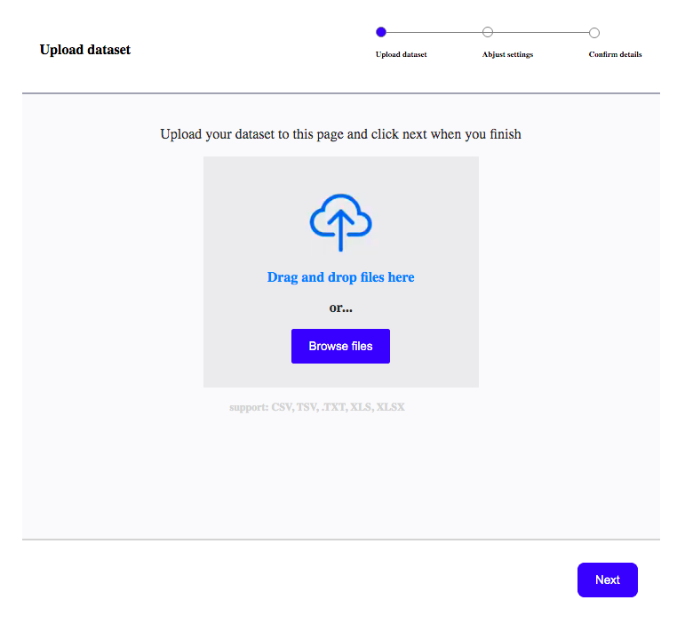

<h1 align=center> ** DATASET ** </h1>

[](https://github.com/RichardLitt/standard-readme)
[](https://david-dm.org/dwyl/esta)


This is a Dataset for uploading csv, tsv etc to a backend server. below are the features the app has: 

1) Import the dataset
	The user has the option of dragging and dropping a dataset or pressing an ‘Upload’ button.

2. Tweak the dataset settings
	The user can choose to exclude some columns from being imported. They also have the
	option of marking a column as:
	- ID (unique identifier),
	- Name (what each row will be called), or
	- Timestamp (date associated with each row)
	Marking a column does not change the column name. Additionally, at most only one
	column can be marked as ID/Name/Timestamp, and one column cannot have multiple
	marks. For example, a column cannot be marked as both ID and Name.
3. Check for any formatting errors within the dataset columns
	This is the final check before the data is imported to the system. The system checks if the ID’s are unique and whether all Timestamp entries are convertible to date format, among other things


#


## Background

- Ruby
- Rails
- Postgresql
- React
- Redux 
- Redux-thunk
- axios
- dropzone-react
- underscoreJS
- styled-css


## Demo
 Check out the live demo of the project. [Click](https://dataset-files.herokuapp.com/)

## Usage

```sh
$ git clone https://github.com/macbright/dataset_mini.git dataset
```
<br /> Clone the repository to your local machine


```sh
$ cd dataset
```
<br /> cd into the directory


`$ bundle install` 
<br /> to install all the gems

`$ npm install` 
<br /> to install all the npm packages

`$ rake db:migrate` 
<br /> to migrate the database

`$ rails server` 
<br /> to start the rails server


## Maintainers 

👤  **Bright Okike**

- Github: [@macbright](https://github.com/macbright)
- LinkedIn: [@bokike](https://www.linkedin.com/in/bokike/)
- Twitter: [@b_okike](https://twitter.com/b_okike)

## Future Features
1.  option for user to edit added events
2.  allow users create events from the web
3.  allow image upload
4. 	users get's sms notification or email notification of upcoming events 
5. 	allow users attend events and see list of other users attending


## Contributing

1. Fork it https://github.com/macbright/dataset_mini.git/fork)
2. Create your feature branch (git checkout -b feature/[choose-a-name])
3. Commit your changes (git commit -am 'What this commit will fix/add')
4. Push to the branch (git push origin feature/[chosen name])
5. Create a new Pull Request

## License

Bright okike
[MIT license](https://opensource.org/licenses/MIT).